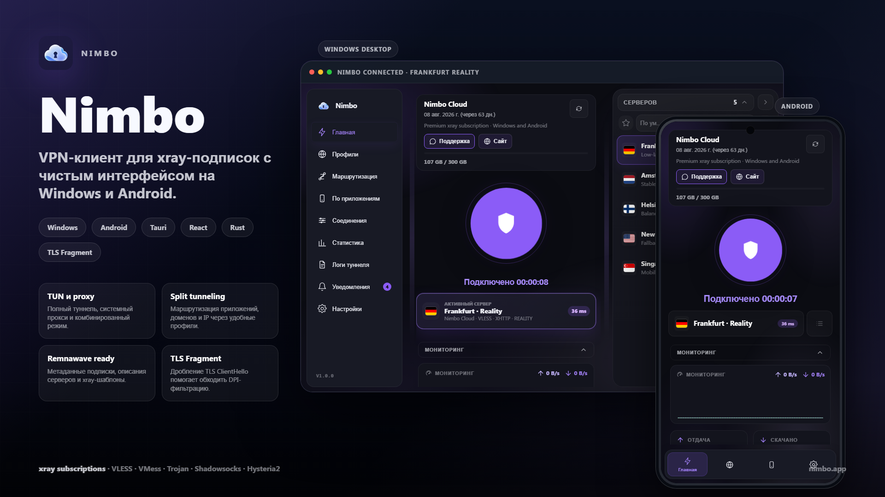

<p align="center">
  
</p>

<h1 align="center">Nimbo</h1>

<p align="center">
  Открытые исходники VPN-клиента для xray-совместимых подписок.
</p>

<p align="center">
  
  
  
  
</p>

<p align="center">
  <a href="#платформы">Платформы</a> ·
  <a href="#возможности">Возможности</a> ·
  <a href="#структура-исходников">Структура</a> ·
  <a href="#сборка">Сборка</a> ·
  <a href="./docs/RELEASE.md">Выпуск</a>
</p>

<p align="center">
  
</p>

## Платформы

| Платформа | Состояние | Технологии |
|---|---|---|
| Windows 10/11 | основной desktop-клиент | Tauri 2, React, Rust, служба и TUN |
| Linux x64 / arm64 | экспериментальная сборка | Tauri 2, React, Rust, AppImage/deb/RPM |
| Android 10+ | поддерживается | Kotlin, Jetpack Compose, `VpnService`, libXray |

Nimbo работает с подписками Remnawave, Marzban, 3x-ui и другими панелями, которые выдают `vless://`, `vmess://`, `trojan://`, `ss://` или `hysteria2://`.

## Возможности

- VLESS (Reality, XHTTP, WebSocket, gRPC), VMess, Trojan, Shadowsocks и Hysteria2;
- системный прокси, TUN и комбинированный режим;
- подписки, серверы, пинг, пользовательские маршруты и split tunneling;
- русская и английская локализация desktop-интерфейса;
- QR-импорт, уведомления и быстрая панель на Android;
- регулярная проверка зависимостей через Dependabot и CI для Linux/Android.

Desktop автоматически получает официальный текущий Xray-core для Windows и Linux на x64, x86 и arm64, если пользователь не предоставил путь через `NIMBO_XRAY_PATH`. Архив проверяется по SHA-256 до установки. Android содержит официальный `libXray 26.7.11`; его обновление описано в [apps/android/README.md](./apps/android/README.md).

## Структура исходников

```text
nimbo/
├── apps/
│   ├── android/       # Android-клиент
│   ├── ui/            # desktop-интерфейс Tauri + React
│   ├── service/       # служба Windows
│   └── installer/     # установщики Windows/Linux
├── crates/            # общие Rust-библиотеки desktop-клиента
├── docs/              # архитектура и инструкции выпуска
└── tools/             # воспроизводимые служебные скрипты
```

Подробности — в [docs/ARCHITECTURE.md](./docs/ARCHITECTURE.md).

## Сборка

### Android

```powershell
cd apps/android
.\gradlew.bat :app:testDebugUnitTest :app:lintDebug :app:assembleRelease
```

Для распространяемого APK нужен собственный keystore. Инструкция и безопасная конфигурация подписи находятся в [apps/android/README.md](./apps/android/README.md).

### Windows и Linux

Нужны Rust 1.80+, Node.js 20+ и зависимости Tauri. Для Linux:

```bash
sudo apt install libwebkit2gtk-4.1-dev libssl-dev libayatana-appindicator3-dev librsvg2-dev build-essential patchelf rpm
cd apps/ui
npm ci
npm run build:linux
```

Для Windows используйте `apps/ui` и `npm run build:installer`. Сборка Linux должна выполняться на Linux (или в WSL2); она создаёт AppImage, DEB и RPM. Подробная инструкция — в [docs/build/linux.md](./docs/build/linux.md), полный чек-лист перед публикацией — в [docs/RELEASE.md](./docs/RELEASE.md).

## Лицензирование и авторство

История desktop-исходников и исходное авторство сохранены. Новые публикации и релизы ведутся в [BBGGVP5/nimbo](https://github.com/BBGGVP5/nimbo).
