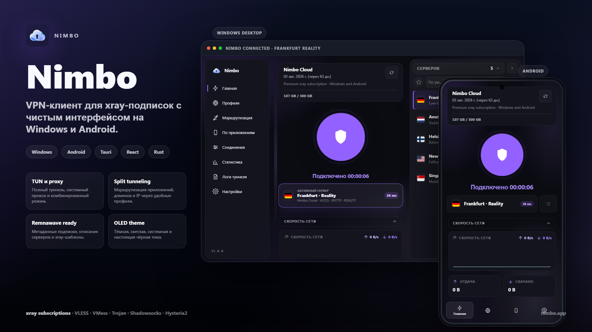

<p align="center">
  
</p>

<h1 align="center">Nimbo</h1>

<p align="center">
  Быстрый и легковесный VPN-клиент для xray-подписок на Windows и Android.
</p>

<p align="center">
  <strong>Русский</strong> · <a href="./README.en.md">English</a>
</p>

<p align="center">
  
  
  
  
  
</p>

<p align="center">
  <a href="#-что-такое-nimbo">Обзор</a> ·
  <a href="#-возможности">Возможности</a> ·
  <a href="#-скачать">Скачать</a> ·
  <a href="#-архитектура">Архитектура</a>
</p>

<p align="center">
  
</p>

---

## ✨ Что такое Nimbo

Nimbo — аккуратный VPN-клиент для xray-совместимых подписок на Windows и Android. Он работает с Remnawave, Marzban, 3x-ui и любыми панелями, которые отдают стандартные ссылки `vless://`, `vmess://`, `trojan://`, `ss://` или `hysteria2://`.

Приложение импортирует URL подписки, показывает доступные серверы, измеряет задержку, генерирует runtime-конфиг для xray и подключает трафик через системный прокси, TUN-режим или оба режима сразу.

---

## 💎 Почему Nimbo

| Акцент | Детали |
|---|---|
| **Легковесность** | Tauri 2 использует системный WebView вместо встроенного Chromium. |
| **Нативное ядро** | Rust-бэкенд, интеграция с xray-core и отдельный helper-сервис для сетевых операций. |
| **Повышение прав один раз** | Сервис устанавливается один раз, поэтому подключение не требует постоянных UAC-подтверждений. |
| **Удобство для провайдеров** | Метаданные подписки, описания серверов, User-Agent пресеты и deep links через `nimbo://`. |
| **Практичная маршрутизация** | TUN, прокси, комбинированный режим, split tunneling и пользовательские профили маршрутизации. |

---

## 🚀 Возможности

### Протоколы

- VLESS: Reality, XHTTP, WebSocket, gRPC, HTTP/2, TCP
- VMess: WebSocket, gRPC, TCP, HTTP Upgrade
- Trojan: TLS, WebSocket, gRPC
- Shadowsocks
- Hysteria2

### Режимы подключения

- Системный прокси: SOCKS5 / HTTP
- TUN-режим: перехват системного трафика
- Комбинированный режим: прокси + TUN

### Управление подписками

- Импорт по URL с метаданными трафика и срока действия
- Автообновление по интервалу
- User-Agent пресеты для совместимости с Happ/Incy
- Импорт через deep link: `nimbo://import?url=...`
- Поддержка метаданных Remnawave, включая описания серверов

### Сетевые инструменты

- Проверка TCP-задержки для всех серверов
- Монитор активного подключения
- Статистика трафика за сессию и за все время
- Защита от DNS-утечек
- Настройки доступа к локальной сети
- Split tunneling по приложениям
- Пользовательские профили маршрутизации: домены, IP, `geosite`, `geoip`

### Интерфейс

- Русский и английский языки
- Темная, светлая, системная и True Black/OLED темы
- Акцентный цвет от провайдера или выбранный вручную
- Быстрые действия из системного трея
- Просмотр логов туннеля
- Компактный адаптивный интерфейс для десктопа и мобильных экранов

---

## 🖥 Платформы

| Платформа | Статус |
|---|---|
| **Windows 10/11** | Основная платформа. NSIS/custom installer, helper-сервис и поддержка TUN. |
| **Linux** | Экспериментальная поддержка AppImage/deb/custom installer. |
| **Android** | Поддерживаемый мобильный клиент. |

---

## 📦 Скачать

Последнюю версию можно скачать на странице [Releases](../../releases).

> Установщик пока не подписан. Windows SmartScreen может показать предупреждение.
> Нажмите **Подробнее** → **Выполнить в любом случае**, если доверяете релизу.

---

## 🧭 Архитектура

```text
Nimbo UI
Tauri 2 + React + WebView2
Окно, трей, настройки, подписки
        |
        | named pipe / JSON IPC
        v
Nimbo Service
Rust, SYSTEM на Windows
xray-core, TUN-адаптер, таблица маршрутов, DNS-защита
```

UI запускается от обычного пользователя. Сервис работает с повышенными правами и берет на себя TUN-адаптер, маршруты, DNS, xray runtime и очистку конфликтующих VPN-процессов.

---

## 📁 Структура проекта

```text
nimbo/
├── apps/
│   ├── ui/             # Tauri 2 + React фронтенд и Tauri-бэкенд
│   ├── service/        # Rust helper-сервис
│   └── installer/      # Кастомный установщик
├── crates/
│   ├── device/         # Генерация HWID
│   ├── ipc/            # Общие типы IPC-протокола
│   ├── subscription/   # Загрузка и парсинг подписок
│   └── xray-config/    # Генерация xray JSON-конфига
├── CHANGELOG_NIMBO.md
├── Cargo.toml
└── README.md
```

---

## 🔌 Совместимость с подписками

Nimbo работает с любыми панелями, которые выдают xray-совместимые подписки:

- **Remnawave**: метаданные, описания серверов и xray-шаблоны
- **Marzban**: base64 subscription links
- **3x-ui**: xray JSON и base64-форматы
- **Другие панели**: стандартные proxy URL

User-Agent по умолчанию:

```text
Nimbo/<version>
```

Для legacy-подписок можно выбрать Happ/Incy User-Agent пресеты в настройках.

---

## 🗺 Планы

- Полировка Android UX
- Импорт подписки через QR-код
- Усиление platform kill switch
- Больше пресетов для split tunneling
- Работа с несколькими профилями
- Подписанный установщик и улучшенное автообновление

---

## 🤝 Участие

1. Откройте issue и опишите предлагаемое изменение.
2. Создайте feature branch.
3. Сделайте сфокусированные коммиты.
4. Запустите проверки перед pull request.
5. Откройте PR с понятным описанием и скриншотами для UI-изменений.

---

## 📄 Лицензия

Проприетарный проект. Все права защищены, если отдельный файл лицензии не говорит иначе.
