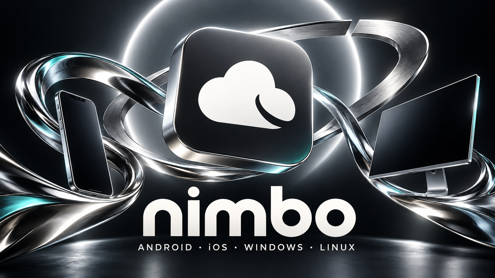

# Постеры Nimbo

## Новый универсальный постер



[PNG — основной вариант](./nimbo-poster-orbit-2026.png) · [PNG — спокойный графитовый вариант](./nimbo-poster-universal-2026.png)

Версия, слово «бета» и список изменений намеренно отсутствуют: постер можно использовать для следующих релизов. Облако взято из новой иконки приложения; устройства на постере — иллюстрация, не скриншоты интерфейса. Исторические `nimbo-poster.png` и `nimbo-poster-en.png` не заменены.

## Происхождение

Создан 8 октября 2026 года встроенным `image_gen`, не CLI. Референсы: прежний постер пользователя и текущая `apps/ui/src-tauri/icons/icon.png`. Текст финального запроса:

```text
+Use case: ads-marketing / style-transfer. User wants this Nimbo poster redesign MORE INTERESTING and visually memorable, not merely a sober graphite still life. Input1 old poster edit target for complete re-imagining; input2 exact CURRENT Nimbo cloud brand. Finished reusable 16:9 LANDSCAPE poster, no version, no beta, no features or changelog. High-end artistic cross-platform campaign, spectacular but tasteful. Composition: large exact graphite rounded app tile with white asymmetric Nimbo cloud floating in center-upper scene, tilted slightly in 3D but cloud perfectly recognizable and unaltered, no lock/keyhole. Create an arresting impossible sculpture around it: broad flowing liquid-chrome bands and a broken elliptical brushed-metal orbital ring sweeping diagonally behind the cloud, creating deep layered negative space. A white luminous inner rim casts silver light, with subtle restrained ice-cyan/teal iridescence reflected on chrome, no oversaturated blue glow. Background: smooth dark ink/graphite void and a soft giant silver halo/portal, NOT the old smoky blue waves, NOT the matte concrete wall scene. Polished studio lighting with beautiful soft ambient bounce and hard controlled specular metal edges. One sleek phone floats on left and one modern very thin desktop screen on right as secondary parts of the sculpture, slightly turned, dark blank screens, no invented UI copy. No decorative particles or wireframe ground. Huge gorgeous lowercase 'nimbo' wordmark in ivory across the lower central zone, clear sculptural sans serif, generous spacing and hierarchy. Bottom line ONLY 'ANDROID · iOS · WINDOWS · LINUX'. Beautiful depth, chrome curves framing but never covering the lettering, bold memorable silhouette when viewed as thumbnail, all inside safe margins. Exact allowed text only 'nimbo' and 'ANDROID · iOS · WINDOWS · LINUX'. No other copy, watermark, lock, extra brand symbols. Preserve original image2 cloud notch/asymmetric tail contour. Opaque backdrop. Aim high-resolution landscape.
```
