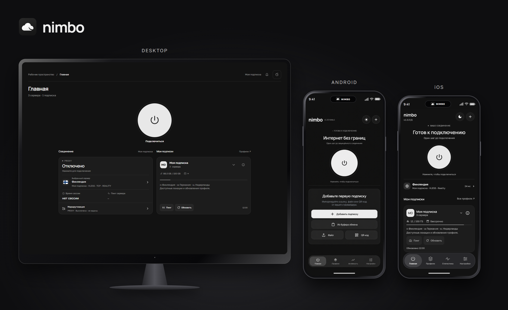
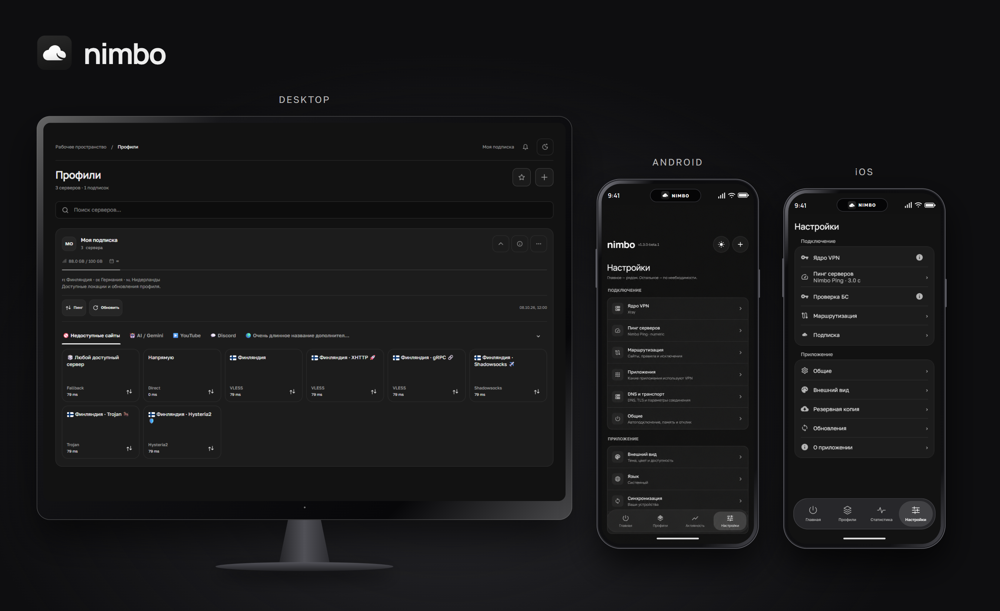

# Новый дизайн Nimbo

## Главная



## Профили и настройки



## Отдельные экраны

| Desktop | Android | iOS |
|---|---|---|
| [Главная](./1.3.0-beta.1/desktop-home.png) | [Главная](./1.3.0-beta.1/android-home.png) | [Главная](./1.3.0-beta.1/ios-compose-home.png) |
| [Группы Mihomo](./1.3.0-beta.1/desktop-mihomo.png) | [Настройки](./1.3.0-beta.1/android-settings.png) | [Настройки](./1.3.0-beta.1/ios-compose-settings.png) |

[PNG — главная в устройствах](./1.3.0-beta.1/devices-home.png) · [PNG — настройки в устройствах](./1.3.0-beta.1/devices-settings.png) · [Постер для релизов](../poster/README.md)

Это превью дизайна. Значения и системное оформление в конкретной ОС могут отличаться; галерея не является проверкой подключения или задержки.

<details><summary>Технические данные и воспроизведение</summary>

Desktop отрисован текущими React-компонентами с изолированными данными. iOS-страницы получены из общей production Compose-разметки на JVM, не на iPhone/Simulator. Android-превью подготовлены из переданных пользователем экранов с помощью `image_gen`: личные подписки удалены, строка состояния в рамках устройств собрана отдельно. Нативная панель iOS в композиции воспроизведена по `NimboTabBar.swift`. Системная строка и пилюля Nimbo в макетах — оформление галереи, не запись Live Activity.

UI-источники desktop/shared соответствуют сборке `a1a16fa80fe4390274927cb80b6b7e4db8ffc12f`. Исходные экраны с личными данными не публикуются. Контрольные суммы и происхождение: [manifest.json](./1.3.0-beta.1/manifest.json).

```powershell
# Из apps/ui; нужны зависимости UI и Playwright из apps/installer:
$env:NIMBO_CHROMIUM_PATH='C:\Program Files\Google\Chrome\Application\chrome.exe'
$env:NIMBO_LAYOUT_ARTIFACT_DIR='C:\path\to\preview-output'
npm run test:polish -- --release-previews

# Из корня репозитория; для shared нужна Java 21:
.\gradlew.bat :shared:desktopTest --tests '*NimboReleasePreviewTest'
node tools/previews/capture-device-showcase.mjs
python tools/previews/check_release_gallery.py
```

107 desktop browser-сценариев; один Compose capture-тест для двух страниц; две композиции устройств с проверками границ, загрузки локальных ресурсов и отсутствия внешних запросов. Снимки исходных экранов после повторного рендера копируются в `1.3.0-beta.1` перед пересборкой композиций; manifest обновляется только после визуальной проверки.

</details>
